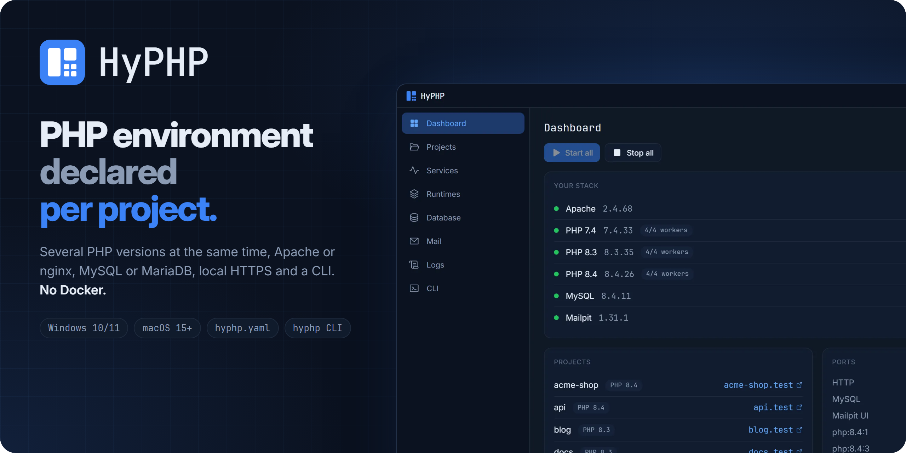

<p align="center">
  
</p>

<h1 align="center">HyPHP</h1>

<p align="center">Ambiente de desenvolvimento PHP para Windows e macOS.<br>Várias versões de PHP ao mesmo tempo, cada projeto declara a sua. Sem Docker.</p>

<p align="center"><a href="README.md">English</a> | <b>Português</b></p>

Ambiente de desenvolvimento PHP com orquestrador próprio: várias versões de PHP servindo
domínios diferentes **ao mesmo tempo**, HTTPS local, workers supervisionados e ambiente
reproduzível por projeto.

Baixe o instalador na página de [Releases](https://github.com/arismarioneves/hyphp/releases/latest)
(Windows 10/11 x64; macOS 15+ em Apple Silicon a partir da 3.1.0, veja [Instalação](#instalação)).
O instalador do Windows ainda não tem assinatura digital: se o Windows avisar, use
**Mais informações → Executar assim mesmo**.

## Por que existe

| Ferramenta | Limitação |
|---|---|
| **XAMPP** | `mod_php`: uma versão de PHP por instalação. Sem domínios locais, sem HTTPS local, órfãos após crash. |
| **Laragon** | Arquitetura correta, mas fechado, sem fonte publicada. A versão de PHP troca por menu ou por *Profile*, que vale para a instalação inteira, e não fica declarada no projeto. |
| **WampServer** | PHP por VirtualHost via FCGI desde a 3.2.8 (changelog oficial), mas só Apache, e a configuração mora nos menus e arquivos da instalação, não no projeto. |
| **DDEV / Devilbox / Lando** | Sólidos e open source, mas exigem Docker — 2–4 GB de RAM antes do primeiro request. |

O HyPHP junta no Windows, sem Docker, o que os outros entregam separado: **vários PHP
atendendo ao mesmo tempo**, a versão **declarada no próprio projeto** (`hyphp.yaml`,
commitável), Apache ou nginx, e workers supervisionados.

## O que faz diferente

- **Multi-versão simultânea real** — `php-cgi` em modo FastCGI externo, um pool por versão,
  um único Apache (ou nginx) na frente. Versão declarada por projeto.
- **Pool de workers** — `php-cgi` no Windows atende um request por vez; sem pool, um request
  lento trava o site. Medido: 2 requests de 3 s levaram 6,2 s em 1 worker e 3 s em 2.
- **Zero processos órfãos** — garantido pelo kernel, via Job Object com kill-on-close.
- **Estado real** — cada serviço tem probe de readiness; a UI mostra `degraded` quando o
  processo vive mas não responde.
- **Ambiente reproduzível** — `hyphp.yaml` commitado no repositório do projeto.
- **Config é saída, não entrada** — `etc/` é gerado e validado (`httpd -t` / `nginx -t`)
  antes de aplicar; config inválida nunca derruba o ambiente.
- **MySQL ou MariaDB** — um ativo por vez, na mesma porta, cada um com o próprio diretório
  de dados. A troca é imediata e volta ao anterior se o novo não subir.
- **php.ini por versão** — diretivas como `max_input_vars` são editadas no app para cada
  versão de PHP, com o valor efetivo e de onde ele vem.
- **CLI para o terminal e agentes de IA** — `hyphp status`, `hyphp start all`,
  `hyphp logs mysql -f`, `hyphp ini 8.3 max_input_vars 5000`… Cada comando roda no app
  aberto, com saída `--json` e códigos de saída que dizem o que houve. Veja [CLI](#cli).
- **Português ou inglês**, tema escuro ou claro (ou igual ao do Windows).

## Plataformas

- **Windows 10/11 x64** — o alvo original, e de propósito o caso mais difícil, já que
  `php-fpm` não existe nessa plataforma.
- **macOS 15+ em Apple Silicon**, a partir da versão 3.1.0. PHP, Apache, nginx, MySQL,
  MariaDB, Mailpit e mkcert vêm do Homebrew. O app tem assinatura ad hoc, sem notarização da
  Apple.

A arquitetura isola o que é específico de sistema operacional em arquivos com build tag.

## `hyphp.yaml`

```yaml
name: acme
domain: acme.test          # default: <name>.test
wildcard: false            # true habilita *.acme.test via resolvedor DNS local
php: "8.1"                 # ausente = versão padrão global
docroot: public            # default: public se existir, senão a raiz
extensions: [pdo_mysql, intl, zip, gd]
database: acme_dev         # criado se ausente
processes:
  queue: php artisan queue:work --tries=3
  scheduler: php artisan schedule:work
```

## CLI

O `hyphp` conversa com o app aberto por um named pipe que só o seu usuário do Windows alcança,
e o app roda o comando com os mesmos serviços da janela: o que a CLI faz aparece na hora na
interface, e a aba **CLI** mostra as chamadas recentes e quem as fez. Ponha no PATH por essa
aba (ela fica em `<instalação>\cli\hyphp.exe`).

```text
hyphp status                          versão, web server, banco, serviços, avisos
hyphp services                        serviços e estados
hyphp start [serviço|all]             inicia e espera ficar pronto (sem argumento: tudo)
hyphp stop [serviço|all]              para (sem argumento: tudo)
hyphp restart <serviço>               reinicia e espera ficar pronto
hyphp logs <serviço> [-n 50] [-f]     últimas linhas do log; -f acompanha
hyphp projects                        projetos, domínio, PHP e pasta
hyphp php | php default <série> | php use <projeto> <série>
hyphp ini <série> [<diretiva> <valor> | <diretiva> --reset]
hyphp db | db create <nome> | db drop <nome> --yes | db engine <mysql|mariadb>
hyphp web <apache|nginx>              troca o web server
hyphp warnings                        avisos da stack
hyphp app                             mostra a janela (abre o app se estiver fechado)
```

Para scripts e agentes de IA: todo comando aceita `--json` (os erros também), e o código de
saída é `0` ok, `1` erro do app, `2` uso errado, `3` app fechado.

## Stack

Go 1.26 · Wails v3 (WebView2) · React 18 + TypeScript · Tailwind v4 · Phosphor Icons

Componentes orquestrados, baixados das fontes oficiais, cada um sob a própria licença:

| Componente | Licença | Origem |
|---|---|---|
| PHP | PHP License 3.01 | windows.php.net |
| Apache httpd | Apache-2.0 | apachelounge.com |
| nginx | BSD-2-Clause | nginx.org |
| MySQL Community | GPL-2.0 | dev.mysql.com |
| MariaDB Server | GPL-2.0 | mariadb.org |
| Mailpit | MIT | github.com/axllent/mailpit |
| mkcert | BSD-3-Clause | github.com/FiloSottile/mkcert |

O HyPHP não redistribui esses binários: baixa sob demanda, verifica o SHA-256 e extrai em
`bin/`. Qualquer build compatível colocada manualmente em `bin/` também é reconhecida.

## Desenvolvimento

Requer Go 1.26+, Node/npm e a CLI do Wails v3:

```bash
go install github.com/wailsapp/wails/v3/cmd/wails3@v3.0.0-beta.23
wails3 doctor     # verifica o ambiente
wails3 dev        # desenvolvimento com hot reload
wails3 build      # binário em bin/
```

Gerar o instalador exige o [NSIS](https://nsis.sourceforge.io/) no `PATH`
(`winget install NSIS.NSIS` instala em `C:\Program Files (x86)\NSIS`, que o
instalador não acrescenta ao `PATH` automaticamente):

```powershell
$env:PATH = 'C:\Program Files (x86)\NSIS;' + $env:PATH
wails3 task windows:package   # bin/hyphp-amd64-installer.exe
```

No Mac, `wails3 task darwin:package` gera o `bin/HyPHP.app` (assinado ad hoc, com a CLI e o
`hyphp-helper` em `Contents/Helpers`) e `wails3 task darwin:package:dmg` gera também o
`bin/HyPHP.dmg`.

O instalador leva `hyphp.exe` e `hyphp-helper.exe`. O helper é o binário com
manifesto `requireAdministrator` que executa as ações elevadas de rede
(escrever no `hosts`, instalar o certificado raiz local, a regra de DNS
curinga); sem ele ao lado do executável principal, essas ações falham. A
quarta e última ação que pede UAC é instalar uma atualização.

### Instalação

O instalador aceita os dois escopos do NSIS:

```powershell
wails3 task windows:package                      # máquina (Program Files, pede UAC)
wails3 task windows:package INSTALL_SCOPE=user   # usuário (sem UAC)
hyphp-amd64-installer.exe /S /D=C:\caminho       # silencioso, diretório à escolha
```

A raiz de dados (`bin/`, `etc/`, `var/`, `log/`) fica **ao lado do executável se
esse diretório for gravável**, senão em `%LOCALAPPDATA%\HyPHP`. É o que permite
instalar em Program Files sem que o app precise de privilégio para funcionar.
`HYPHP_ROOT` sobrepõe a regra.

A desinstalação remove o diretório de instalação, mas **não** desfaz o que o
usuário aplicou no sistema: o bloco do `hosts`, a regra de DNS `.test` e a
entrada de autostart saem pela própria interface (card **Permissões** em
Configurações e o toggle de início automático), antes de desinstalar.

No macOS (a partir da 3.1.0), este comando no Terminal instala ou atualiza o
`/Applications/HyPHP.app`:

```bash
curl -fsSL https://github.com/arismarioneves/hyphp/releases/latest/download/install.sh | sh
```

Ele confere o SHA-256 do dmg contra o manifesto da release, fecha o HyPHP se estiver aberto e
só pede a senha quando `/Applications` não aceita gravação. O dmg da página de Releases também
serve, mas o macOS bloqueia a primeira abertura de um app baixado pelo navegador sem
notarização da Apple: libere uma vez em **Ajustes do Sistema › Privacidade e Segurança ›
Abrir Mesmo Assim**. A raiz de dados é `~/Library/Application Support/HyPHP` (`HYPHP_ROOT`
sobrepõe).

Para desinstalar no macOS:

```bash
curl -fsSL https://github.com/arismarioneves/hyphp/releases/latest/download/uninstall.sh | sh
```

O script fecha o app, remove a regra de DNS `.test`, o `/etc/paths.d/hyphp` e a confiança na
CA do mkcert (pedindo a senha de administrador), depois a entrada de início automático, a
pasta `cli` e o app. Os dados (bancos, configurações, logs) ficam, a menos que você confirme
no Terminal ou rode `curl -fsSL …/uninstall.sh | sh -s -- --apagar-dados`. O Homebrew, as
fórmulas e os arquivos da CA do mkcert não são tocados.

### Atualizações

O app verifica a release mais nova em
`https://github.com/arismarioneves/hyphp/releases/latest/download/latest.json`
um minuto depois de abrir e a cada 6 horas (desligável em Configurações ›
Atualizações) e baixa o instalador novo em segundo plano. O manifesto é assinado
com ed25519 (chave pública em `internal/update/key.go`) e traz o SHA-256 do
instalador; o app recusa manifesto ou instalador que não batam. A instalação só
acontece no clique em **Atualizar e reiniciar**: os serviços param, o Windows
pede permissão uma vez e o app volta sozinho na versão nova.

No macOS o app troca o próprio bundle pelo do dmg novo, sem senha quando a pasta do app aceita
gravação (conta de administrador em `/Applications`); senão, mostra o comando do Terminal
acima.

Builds de desenvolvimento (sem `-tags production`) não participam.

### Publicar uma versão

A versão vive em cinco lugares:
`internal/version/version.go`, `info.version` em `build/config.yml`,
`build/windows/info.json`, `INFO_PRODUCTVERSION` em
`build/windows/nsis/wails_tools.nsh` e `CFBundleShortVersionString`/`CFBundleVersion` em
`build/darwin/Info.plist` (suba também o `build/darwin/Info.dev.plist`, que não é conferido).
Os plists do macOS são editados à mão: não rode `wails3 task common:update:build-assets`.
As notas vão em `release/notas/<versão>.json`, nos dois idiomas, os mesmos itens na mesma
ordem (o site mostra as do idioma escolhido):

```json
{ "pt": ["O que mudou"], "en": ["What changed"] }
```

As releases são geradas e publicadas pelo workflow `build` (`.github/workflows/build.yml`) a
partir de uma tag `v<versão>` na `main`. A release é imutável: as notas precisam estar certas
antes de publicar.

## Apoie o projeto

O HyPHP é gratuito. Se ele economiza o seu tempo, você pode apoiar o desenvolvimento:

[](https://buymeacoffee.com/arismarioneves)

## Licença

O código fica aberto para leitura, no modelo *open core* do Chatwoot e do GitLab:

- **Tudo fora de `enterprise/`** usa a [PolyForm Shield 1.0.0](LICENSE). Qualquer
  pessoa ou empresa pode usar o HyPHP de graça, inclusive no trabalho, e estudar,
  modificar e compartilhar o código. O que ela não permite é oferecer um produto
  que concorra com o HyPHP ou com os recursos pagos dele, seja pago ou gratuito,
  o que inclui vender o próprio HyPHP.
- **`enterprise/`** vai guardar os recursos pagos, com [licença própria](enterprise/LICENSE)
  e uso por assinatura. Hoje ela só tem a licença: ainda não existe recurso pago.

Ao enviar um pull request, você concorda com o [CLA](CLA.md); ver [CONTRIBUTING.md](CONTRIBUTING.md) (em inglês).

Os componentes que o HyPHP baixa (tabela em [Stack](#stack)) seguem cada um a
própria licença.
